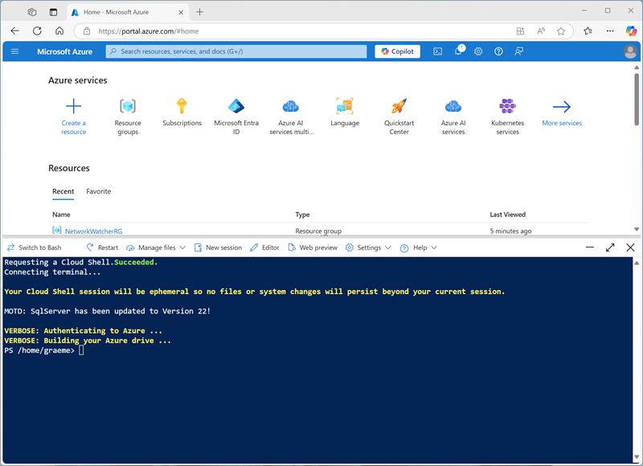

---
lab:
  title: Entrenamiento de un modelo de aprendizaje profundo
---

# Entrenamiento de un modelo de aprendizaje profundo

En este ejercicio, usará la biblioteca de **PyTorch** para entrenar un modelo de aprendizaje profundo en Azure Databricks. A continuación, usará la biblioteca **Horovod** para distribuir el entrenamiento de aprendizaje profundo en varios nodos de trabajo de un clúster.

Este ejercicio debería tardar en completarse **45** minutos aproximadamente.

## Antes de empezar

Necesitará una [suscripción de Azure](https://azure.microsoft.com/free) en la que tenga acceso de nivel administrativo.

## Aprovisiona un área de trabajo de Azure Databricks.

> **Sugerencia**: si ya tienes un área de trabajo de Azure Databricks, puedes omitir este procedimiento y usar el área de trabajo existente.

En este ejercicio, se incluye un script para aprovisionar una nueva área de trabajo de Azure Databricks. El script intenta crear un recurso de área de trabajo de Azure Databricks de nivel *Premium* en una región en la que la suscripción de Azure tiene cuota suficiente para los núcleos de proceso necesarios en este ejercicio, y da por hecho que la cuenta de usuario tiene permisos suficientes en la suscripción para crear un recurso de área de trabajo de Azure Databricks. Si se produjese un error en el script debido a cuota o permisos insuficientes, intenta [crear un área de trabajo de Azure Databricks de forma interactiva en Azure Portal](https://learn.microsoft.com/azure/databricks/getting-started/#--create-an-azure-databricks-workspace).

1. En un explorador web, inicia sesión en [Azure Portal](https://portal.azure.com) en `https://portal.azure.com`.
2. Usa el botón **[\>_]** a la derecha de la barra de búsqueda en la parte superior de la página para crear un nuevo Cloud Shell en Azure Portal, selecciona un entorno de ***PowerShell*** y crea almacenamiento si se te solicita. Cloud Shell proporciona una interfaz de línea de comandos en un panel situado en la parte inferior de Azure Portal, como se muestra a continuación:

    

    > **Nota**: si creaste anteriormente un Cloud Shell que usa un entorno de *Bash*, usa el menú desplegable situado en la parte superior izquierda del panel de Cloud Shell para cambiarlo a ***PowerShell***.

3. Ten en cuenta que puedes cambiar el tamaño de Cloud Shell arrastrando la barra de separación en la parte superior del panel, o usando los iconos **&#8212;** , **&#9723;** y **X** en la parte superior derecha para minimizar, maximizar y cerrar el panel. Para obtener más información sobre el uso de Azure Cloud Shell, consulta la [documentación de Azure Cloud Shell](https://docs.microsoft.com/azure/cloud-shell/overview).

4. En el panel de PowerShell, introduce los siguientes comandos para clonar este repositorio:

    ```
    rm -r mslearn-databricks -f
    git clone https://github.com/MicrosoftLearning/mslearn-databricks
    ```

5. Una vez clonado el repositorio, escribe el siguiente comando para ejecutar el script **setup.ps1**, que aprovisiona un área de trabajo de Azure Databricks en una región disponible:

    ```
    ./mslearn-databricks/setup.ps1
    ```

6. Si se solicita, elige la suscripción que quieres usar (esto solo ocurrirá si tienes acceso a varias suscripciones de Azure).
7. Espera a que se complete el script: normalmente puede tardar entre 5 y 10 minutos, pero en algunos casos puede tardar más. Mientras espera, revise el artículo [Entrenamiento distribuido](https://learn.microsoft.com/azure/databricks/machine-learning/train-model/distributed-training/) en la documentación de Azure Databricks.

## Crear un clúster

Azure Databricks es una plataforma de procesamiento distribuido que usa clústeres* de Apache Spark *para procesar datos en paralelo en varios nodos. Cada clúster consta de un nodo de controlador para coordinar el trabajo y nodos de trabajo para hacer tareas de procesamiento. En este ejercicio, crearás un clúster de *nodo único* para minimizar los recursos de proceso usados en el entorno de laboratorio (en los que se pueden restringir los recursos). En un entorno de producción, normalmente crearías un clúster con varios nodos de trabajo.

> **Sugerencia**: Si ya dispone de un clúster con una versión de runtime 13.3 LTS **<u>ML</u>** o superior en su área de trabajo de Azure Databricks, puede utilizarlo para completar este ejercicio y omitir este procedimiento.

1. En Azure Portal, vaya al grupo de recursos **msl-*xxxxxxx*** que se creó con el script (o al grupo de recursos que contiene el área de trabajo de Azure Databricks existente)
1. Selecciona el recurso Azure Databricks Service (llamado **databricks-*xxxxxxx*** si usaste el script de instalación para crearlo).
1. En la página **Información general** del área de trabajo, usa el botón **Inicio del área de trabajo** para abrir el área de trabajo de Azure Databricks en una nueva pestaña del explorador; inicia sesión si se solicita.

    > **Sugerencia**: al usar el portal del área de trabajo de Databricks, se pueden mostrar varias sugerencias y notificaciones. Descártalas y sigue las instrucciones proporcionadas para completar las tareas de este ejercicio.

1. En la barra lateral de la izquierda, selecciona la tarea **(+) Nuevo** y luego selecciona **Clúster**.
1. En la página **Nuevo clúster**, crea un clúster con la siguiente configuración:
    - **Nombre del clúster**: clúster del *Nombre de usuario*  (el nombre del clúster predeterminado)
    - **Directiva**: Unrestricted (Sin restricciones)
    - **Modo de clúster** de un solo nodo
    - **Modo de acceso**: usuario único (*con la cuenta de usuario seleccionada*)
    - **Versión de runtime de Databricks**: *Seleccione la edición de **<u>ML</u>** de la última versión no beta más reciente del runtime (**No** una versión de runtime estándar) que:*
        - ***No** usa una GPU*
        - *Incluye Scala > **2.11***
        - *Incluye Spark > **3.4***
    - **Utilizar la Aceleración de fotones**: <u>No</u> seleccionada
    - **Tipo de nodo**: Standard_DS3_v2.
    - **Finaliza después de** *20* **minutos de inactividad**

1. Espera a que se cree el clúster. Esto puede tardar un par de minutos.

> **Nota**: si el clúster no se inicia, es posible que la suscripción no tenga cuota suficiente en la región donde se aprovisiona el área de trabajo de Azure Databricks. Para obtener más información, consulta [El límite de núcleos de la CPU impide la creación de clústeres](https://docs.microsoft.com/azure/databricks/kb/clusters/azure-core-limit). Si esto sucede, puedes intentar eliminar el área de trabajo y crear una nueva en otra región. Puedes especificar una región como parámetro para el script de configuración de la siguiente manera: `./mslearn-databricks/setup.ps1 eastus`

## Crear un cuaderno

Va a ejecutar código que use la biblioteca MLLib de Spark para entrenar un modelo de Machine Learning, por lo que el primer paso es crear un cuaderno en el área de trabajo.

1. En la barra lateral, usa el vínculo **(+) Nuevo** para crear un **cuaderno**.
1. Cambie el nombre predeterminado del cuaderno (**Cuaderno sin título *[fecha]***) a **Aprendizaje profundo** y, en la lista desplegable **Conectar**, seleccione su clúster si aún no está seleccionado. Si el clúster no se está ejecutando, puede tardar un minuto en iniciarse.

## Ingesta y preparación de datos

El escenario de este ejercicio se basa en observaciones de pingüinos en la Antártida, con el objetivo de entrenar un modelo de Machine Learning para predecir la especie de un pingüino observado basándose en su ubicación y en las medidas de su cuerpo.

> **Cita**: El conjunto de datos sobre pingüinos que se usa en este ejercicio es un subconjunto de datos que han recopilado y hecho público el [Dr. Kristen Gorman](https://www.uaf.edu/cfos/people/faculty/detail/kristen-gorman.php) y la [Palmer Station, Antarctica LTER](https://pal.lternet.edu/), miembro de la [Long Term Ecological Research Network](https://lternet.edu/).

1. En la primera celda del cuaderno, escriba el siguiente código, que utiliza comandos de *shell* para descargar los datos de pingüinos de GitHub en el sistema de archivos utilizado por el clúster.

    ```bash
    %sh
    rm -r /dbfs/deepml_lab
    mkdir /dbfs/deepml_lab
    wget -O /dbfs/deepml_lab/penguins.csv https://raw.githubusercontent.com/MicrosoftLearning/mslearn-databricks/main/data/penguins.csv
    ```

1. Use la opción de menú **&#9656; Ejecutar celda** situado a la izquierda de la celda para ejecutarla. A continuación, espera a que se complete el trabajo Spark ejecutado por el código.
1. Ahora prepare los datos para el aprendizaje automático. Debajo de la celda de código existente, usa el icono **+** para agregar una nueva celda de código. A continuación, en la nueva celda, escriba y ejecute el siguiente código para:
    - Quitar las filas incompletas
    - Codificar el nombre de la isla (cadena) como un número entero
    - Aplicar tipos de datos adecuados
    - Normalizar los datos numéricos a una escala similar
    - Dividir los datos en dos conjuntos: uno de entrenamiento y otro de prueba.

    ```python
   from pyspark.sql.types import *
   from pyspark.sql.functions import *
   from sklearn.model_selection import train_test_split
   
   # Load the data, removing any incomplete rows
   df = spark.read.format("csv").option("header", "true").load("/deepml_lab/penguins.csv").dropna()
   
   # Encode the Island with a simple integer index
   # Scale FlipperLength and BodyMass so they're on a similar scale to the bill measurements
   islands = df.select(collect_set("Island").alias('Islands')).first()['Islands']
   island_indexes = [(islands[i], i) for i in range(0, len(islands))]
   df_indexes = spark.createDataFrame(island_indexes).toDF('Island', 'IslandIdx')
   data = df.join(df_indexes, ['Island'], 'left').select(col("IslandIdx"),
                      col("CulmenLength").astype("float"),
                      col("CulmenDepth").astype("float"),
                      (col("FlipperLength").astype("float")/10).alias("FlipperScaled"),
                       (col("BodyMass").astype("float")/100).alias("MassScaled"),
                      col("Species").astype("int")
                       )
   
   # Oversample the dataframe to triple its size
   # (Deep learning techniques like LOTS of data)
   for i in range(1,3):
       data = data.union(data)
   
   # Split the data into training and testing datasets   
   features = ['IslandIdx','CulmenLength','CulmenDepth','FlipperScaled','MassScaled']
   label = 'Species'
      
   # Split data 70%-30% into training set and test set
   x_train, x_test, y_train, y_test = train_test_split(data.toPandas()[features].values,
                                                       data.toPandas()[label].values,
                                                       test_size=0.30,
                                                       random_state=0)
   
   print ('Training Set: %d rows, Test Set: %d rows \n' % (len(x_train), len(x_test)))
    ```

## Instalación e importación de las bibliotecas de PyTorch

PyTorch es un marco para crear modelos de aprendizaje automático, incluidas redes neuronales profundas (DNN). Dado que planeamos usar PyTorch para crear nuestro clasificador de pingüinos, tendremos que importar las bibliotecas de PyTorch que pretendemos usar. PyTorch ya está instalado en los clústeres Azure Databricks con un tiempo de ejecución ML Databricks (la instalación específica de PyTorch depende de si el clúster dispone de unidades de procesamiento gráfico (GPU) que puedan utilizarse para el procesamiento de alto rendimiento a través de *cuda*).

1. Agregue una nueva celda de código y ejecute el siguiente código para prepararse para usar PyTorch:

    ```python
   import torch
   import torch.nn as nn
   import torch.utils.data as td
   import torch.nn.functional as F
   
   # Set random seed for reproducability
   torch.manual_seed(0)
   
   print("Libraries imported - ready to use PyTorch", torch.__version__)
    ```

## Crear cargadores de datos

PyTorch usa *cargadores de datos* para cargar datos de entrenamiento y validación en lotes. Ya hemos cargado los datos en matrices numpy, pero necesitamos envolverlos en conjuntos de datos PyTorch (en los que los datos se convierten en objetos *tensor* PyTorch) y crear cargadores para leer lotes de esos conjuntos de datos.

1. Agregue una celda y ejecute el siguiente código para preparar los cargadores de datos:

    ```python
   # Create a dataset and loader for the training data and labels
   train_x = torch.Tensor(x_train).float()
   train_y = torch.Tensor(y_train).long()
   train_ds = td.TensorDataset(train_x,train_y)
   train_loader = td.DataLoader(train_ds, batch_size=20,
       shuffle=False, num_workers=1)

   # Create a dataset and loader for the test data and labels
   test_x = torch.Tensor(x_test).float()
   test_y = torch.Tensor(y_test).long()
   test_ds = td.TensorDataset(test_x,test_y)
   test_loader = td.DataLoader(test_ds, batch_size=20,
                                shuffle=False, num_workers=1)
   print('Ready to load data')
    ```

## Definición de una red neuronal

Ahora estamos listos para definir nuestra red neuronal. En este caso, crearemos una red que conste de 3 capas totalmente conectadas:

- Una capa de entrada que recibe un valor de entrada para cada característica (en este caso, el índice de la isla y cuatro mediciones de pingüinos) y genera 10 salidas.
- Una capa oculta que recibe diez entradas de la capa de entrada y envía diez salidas a la capa siguiente.
- Una capa de salida que genera un vector de probabilidades para cada una de las tres especies de pingüinos posibles.

A medida que entrenamos la red pasando datos a través de ella, la función de **pérdida** aplicará funciones de activación de *RELU* a las dos primeras capas (para restringir los resultados a números positivos) y devolver una capa de salida final que use una función de *log_softmax* para devolver un valor que represente una puntuación de probabilidad para cada una de las tres clases posibles.

1. Ejecute el siguiente código para definir la red neuronal:

    ```python
   # Number of hidden layer nodes
   hl = 10
   
   # Define the neural network
   class PenguinNet(nn.Module):
       def __init__(self):
           super(PenguinNet, self).__init__()
           self.fc1 = nn.Linear(len(features), hl)
           self.fc2 = nn.Linear(hl, hl)
           self.fc3 = nn.Linear(hl, 3)
   
       def forward(self, x):
           fc1_output = torch.relu(self.fc1(x))
           fc2_output = torch.relu(self.fc2(fc1_output))
           y = F.log_softmax(self.fc3(fc2_output).float(), dim=1)
           return y
   
   # Create a model instance from the network
   model = PenguinNet()
   print(model)
    ```

## Crear funciones para entrenar y probar un modelo de red neuronal

Para entrenar el modelo, tenemos que introducir repetidamente los valores de entrenamiento en la red, utilizar una función de pérdida para calcularla, utilizar un optimizador para retropropagar los ajustes de pesos y valores de sesgo, y validar el modelo utilizando los datos de prueba que retuvimos.

1. Para ello, use el siguiente código para crear una función para entrenar y optimizar el modelo y la función para probar el modelo.

    ```python
   def train(model, data_loader, optimizer):
       device = torch.device('cuda' if torch.cuda.is_available() else 'cpu')
       model.to(device)
       # Set the model to training mode
       model.train()
       train_loss = 0
       
       for batch, tensor in enumerate(data_loader):
           data, target = tensor
           #feedforward
           optimizer.zero_grad()
           out = model(data)
           loss = loss_criteria(out, target)
           train_loss += loss.item()
   
           # backpropagate adjustments to the weights
           loss.backward()
           optimizer.step()
   
       #Return average loss
       avg_loss = train_loss / (batch+1)
       print('Training set: Average loss: {:.6f}'.format(avg_loss))
       return avg_loss
              
               
   def test(model, data_loader):
       device = torch.device('cuda' if torch.cuda.is_available() else 'cpu')
       model.to(device)
       # Switch the model to evaluation mode (so we don't backpropagate)
       model.eval()
       test_loss = 0
       correct = 0
   
       with torch.no_grad():
           batch_count = 0
           for batch, tensor in enumerate(data_loader):
               batch_count += 1
               data, target = tensor
               # Get the predictions
               out = model(data)
   
               # calculate the loss
               test_loss += loss_criteria(out, target).item()
   
               # Calculate the accuracy
               _, predicted = torch.max(out.data, 1)
               correct += torch.sum(target==predicted).item()
               
       # Calculate the average loss and total accuracy for this epoch
       avg_loss = test_loss/batch_count
       print('Validation set: Average loss: {:.6f}, Accuracy: {}/{} ({:.0f}%)\n'.format(
           avg_loss, correct, len(data_loader.dataset),
           100. * correct / len(data_loader.dataset)))
       
       # return average loss for the epoch
       return avg_loss
    ```

## Entrenamiento de un modelo

Ahora puede usar las funciones de **entrenamiento** y **prueba** para entrenar un modelo de red neuronal. Las redes neuronales se entrenan de forma iterativa en varias *épocas*, registrando las estadísticas de pérdida y precisión de cada época.

1. Use el siguiente código para entrenar el modelo:

    ```python
   # Specify the loss criteria (we'll use CrossEntropyLoss for multi-class classification)
   loss_criteria = nn.CrossEntropyLoss()
   
   # Use an optimizer to adjust weights and reduce loss
   learning_rate = 0.001
   optimizer = torch.optim.Adam(model.parameters(), lr=learning_rate)
   optimizer.zero_grad()
   
   # We'll track metrics for each epoch in these arrays
   epoch_nums = []
   training_loss = []
   validation_loss = []
   
   # Train over 100 epochs
   epochs = 100
   for epoch in range(1, epochs + 1):
   
       # print the epoch number
       print('Epoch: {}'.format(epoch))
       
       # Feed training data into the model
       train_loss = train(model, train_loader, optimizer)
       
       # Feed the test data into the model to check its performance
       test_loss = test(model, test_loader)
       
       # Log the metrics for this epoch
       epoch_nums.append(epoch)
       training_loss.append(train_loss)
       validation_loss.append(test_loss)
    ```

    Mientras se ejecuta el proceso de entrenamiento, vamos a intentar comprender lo que sucede:

    - En cada *época*, el conjunto completo de datos de entrenamiento pasa a través de la red. Hay cinco características para cada observación, y cinco nodos correspondientes en la capa de entrada, por lo que las características de cada observación se pasan como un vector de cinco valores a esa capa. Sin embargo, por motivos de eficacia, los vectores de características se agrupan en lotes, de modo que cada vez se introduce una matriz de múltiples vectores de características.
    - La matriz de valores de características es procesada por una función que realiza una suma ponderada utilizando pesos y valores de sesgo inicializados. El resultado de esta función es procesado por la función de activación de la capa de entrada para limitar los valores transmitidos a los nodos de la capa siguiente.
    - Las funciones de suma ponderada y activación se repiten en cada capa. Tenga en cuenta que las funciones operan sobre vectores y matrices en lugar de sobre valores escalares individuales. En otras palabras, el paso hacia delante es esencialmente una serie de funciones de álgebra lineal anidadas. Esta es la razón por la que los científicos de datos prefieren usar equipos con unidades de procesamiento gráfico (GPU), ya que están optimizados para cálculos matriciales y vectoriales.
    - En la última capa de la red, los vectores de salida contienen un valor calculado para cada clase posible (en este caso, las clases 0, 1 y 2). Este vector se procesa mediante una *función de pérdida* que determina en qué medida se alejan de los valores esperados en función de las clases reales; así, por ejemplo, supongamos que el resultado de una observación de un pingüino papúa (clase 1) es \[0,3, 0,4, 0,3\]. La predicción correcta sería \[0,0, 1,0, 0,0\], por lo que la varianza entre los valores predichos y los reales (lo lejos que está cada valor predicho de lo que debería ser) es \[0,3, 0,6, 0,3\]. Esta varianza se agrega para cada lote y se mantiene como un agregado en ejecución para calcular el nivel global de error (*pérdida*) en que incurren los datos de entrenamiento para la época.
    - Al final de cada época, los datos de validación pasan por la red y se calculan también su pérdida y precisión (proporción de predicciones correctas basadas en el valor de probabilidad más alto del vector de salida). Es útil hacer esto porque nos permite comparar el rendimiento del modelo después de cada época usando datos en los que no fue entrenado, ayudándonos a determinar si generalizará bien para los nuevos datos o si está *sobreajustado* a los datos de entrenamiento.
    - Una vez que todos los datos han pasado por la red, la salida de la función de pérdida para los datos de *entrenamiento* (pero <u>no</u> para los datos de *validación*) se pasa al optimizador. Los detalles precisos de cómo el optimizador procesa la pérdida varían dependiendo del algoritmo de optimización específico que se utilice; pero fundamentalmente se puede pensar en toda la red, desde la capa de entrada hasta la función de pérdida como una gran función anidada (*compuesta*). El optimizador aplica algo de cálculo diferencial para calcular las *derivadas parciales* de la función con respecto a cada valor de peso y sesgo que se utilizó en la red. Es posible hacer esto de manera eficiente para una función anidada debido a algo llamado la *regla de la cadena*, que le permite determinar la derivada de una función compuesta a partir de las derivadas de su función interna y funciones externas. No es necesario que se preocupe por los detalles matemáticos (el optimizador lo hace por usted), pero el resultado final es que las derivadas parciales nos indican la pendiente (o *gradiente*) de la función de pérdida con respecto a cada valor de peso y sesgo; en otras palabras, podemos determinar si aumentar o disminuir los valores de peso y sesgo para minimizar la pérdida.
    - Una vez determinada la dirección en la que deben ajustarse los pesos y los sesgos, el optimizador utiliza la *tasa de aprendizaje* para determinar cuánto debe ajustarlos y luego trabaja hacia atrás a través de la red en un proceso llamado *retropropagación* para asignar nuevos valores a los pesos y sesgos de cada capa.
    - Ahora, la siguiente época repite todo el proceso de entrenamiento, validación y retropropagación comenzando con los pesos y sesgos revisados de la época anterior, lo que esperamos que resulte en un menor nivel de pérdida.
    - El proceso continúa así durante 100 épocas.

## Revisión de la pérdida de entrenamiento y validación

Una vez completado el entrenamiento, podemos examinar las métricas de pérdida que registramos durante el entrenamiento y la validación del modelo. En realidad buscamos dos cosas:

- La pérdida debería reducirse con cada época, lo que demuestra que el modelo está aprendiendo los pesos y sesgos adecuados para predecir las etiquetas correctas.
- La pérdida de entrenamiento y la pérdida de validación deben seguir una tendencia similar, lo que muestra que el modelo no se sobreajusta a los datos de entrenamiento.

1. Use el siguiente código para trazar la pérdida:

    ```python
   %matplotlib inline
   from matplotlib import pyplot as plt
   
   plt.plot(epoch_nums, training_loss)
   plt.plot(epoch_nums, validation_loss)
   plt.xlabel('epoch')
   plt.ylabel('loss')
   plt.legend(['training', 'validation'], loc='upper right')
   plt.show()
    ```

## Visualización de los pesos y sesgos aprendidos

El modelo entrenado consta de los pesos y sesgos finales determinados por el optimizador durante el entrenamiento. Basándonos en nuestro modelo de red, deberíamos esperar los siguientes valores para cada capa:

- Capa 1 (*fc1*): Hay cinco valores de entrada que van a diez nodos de salida, por lo que debe haber 10 x 5 pesos y 10 valores de sesgo.
- Capa 2 (*fc2*): Hay diez valores de entrada que van a diez nodos de salida, por lo que debería haber 10 x 10 pesos y 10 valores de sesgo.
- Capa 3 (*fc3*): Hay diez valores de entrada que van a tres nodos de salida, por lo que debería haber 3 x 10 pesos y 3 valores de sesgo.

1. Use el siguiente código para ver las capas del modelo entrenado:

    ```python
   for param_tensor in model.state_dict():
       print(param_tensor, "\n", model.state_dict()[param_tensor].numpy())
    ```

## Guardar y usar el modelo entrenado

Ahora que tenemos un modelo entrenado, podemos guardar sus pesos entrenados para utilizarlos más adelante.

1. Use el siguiente código para guardar el modelo:

    ```python
   # Save the model weights
   model_file = '/dbfs/penguin_classifier.pt'
   torch.save(model.state_dict(), model_file)
   del model
   print('model saved as', model_file)
    ```

1. Use el siguiente código para cargar los pesos del modelo y predecir la especie para una nueva observación de pingüinos:

    ```python
   # New penguin features
   x_new = [[1, 50.4,15.3,20,50]]
   print ('New sample: {}'.format(x_new))
   
   # Create a new model class and load weights
   model = PenguinNet()
   model.load_state_dict(torch.load(model_file))
   
   # Set model to evaluation mode
   model.eval()
   
   # Get a prediction for the new data sample
   x = torch.Tensor(x_new).float()
   _, predicted = torch.max(model(x).data, 1)
   
   print('Prediction:',predicted.item())
    ```

## Limpiar

En el portal de Azure Databricks, en la página **Proceso**, selecciona el clúster y **&#9632; Finalizar** para apagarlo.

Si has terminado de explorar Azure Databricks, puedes eliminar los recursos que has creado para evitar costes innecesarios de Azure y liberar capacidad en tu suscripción.
