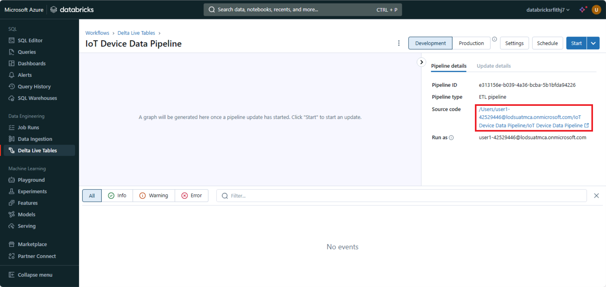

---
lab:
  title: "Canalización de streaming de un extremo a otro con Delta\_Live\_Tables en Azure\_Databricks"
---

# Canalización de streaming de un extremo a otro con Delta Live Tables en Azure Databricks

La creación de una canalización de streaming de un extremo a otro con Delta Live Tables en Azure Databricks implica definir transformaciones en los datos, que Delta Live Tables administra a través de la orquestación de tareas, la administración de clústeres y la supervisión. Este marco admite tablas de streaming para controlar datos que se actualizan continuamente, vistas materializadas para transformaciones complejas y vistas para transformaciones y comprobaciones de calidad de datos intermedias.

Este laboratorio se tarda aproximadamente **30** minutos en completarse.

> **Nota**: la interfaz de usuario de Azure Databricks está sujeta a una mejora continua. Es posible que la interfaz de usuario haya cambiado desde que se escribieron las instrucciones de este ejercicio.

## Aprovisiona un área de trabajo de Azure Databricks.

> **Sugerencia**: si ya tienes un área de trabajo de Azure Databricks, puedes omitir este procedimiento y usar el área de trabajo existente.

En este ejercicio, se incluye un script para aprovisionar una nueva área de trabajo de Azure Databricks. El script intenta crear un recurso de área de trabajo de Azure Databricks de nivel *Premium* en una región en la que la suscripción de Azure tiene cuota suficiente para los núcleos de proceso necesarios en este ejercicio, y da por hecho que la cuenta de usuario tiene permisos suficientes en la suscripción para crear un recurso de área de trabajo de Azure Databricks. Si se produjese un error en el script debido a cuota o permisos insuficientes, intenta [crear un área de trabajo de Azure Databricks de forma interactiva en Azure Portal](https://learn.microsoft.com/azure/databricks/getting-started/#--create-an-azure-databricks-workspace).

1. En un explorador web, inicia sesión en [Azure Portal](https://portal.azure.com) en `https://portal.azure.com`.
2. Usa el botón **[\>_]** situado a la derecha de la barra de búsqueda en la parte superior de la página para crear una nueva instancia de Cloud Shell en Azure Portal, para lo que deberás seleccionar un entorno de ***PowerShell***. Cloud Shell proporciona una interfaz de línea de comandos en un panel situado en la parte inferior de Azure Portal, como se muestra a continuación:

    

    > **Nota**: si has creado anteriormente una instancia de Cloud Shell que usa un entorno de *Bash*, cámbiala a ***PowerShell***.

3. Ten en cuenta que puedes cambiar el tamaño de la instancia de Cloud Shell. Para ello, arrastra la barra de separación de la parte superior del panel o utiliza los iconos **&#8212;**, **&#10530;** y **X** de la parte superior derecha del panel para minimizar, maximizar y cerrar el panel. Para obtener más información sobre el uso de Azure Cloud Shell, consulta la [documentación de Azure Cloud Shell](https://docs.microsoft.com/azure/cloud-shell/overview).

4. En el panel de PowerShell, introduce los siguientes comandos para clonar este repositorio:

     ```powershell
    rm -r mslearn-databricks -f
    git clone https://github.com/MicrosoftLearning/mslearn-databricks
     ```

5. Una vez clonado el repositorio, escribe el siguiente comando para ejecutar el script **setup.ps1**, que aprovisiona un área de trabajo de Azure Databricks en una región disponible:

     ```powershell
    ./mslearn-databricks/setup.ps1
     ```

6. Si se solicita, elige la suscripción que quieres usar (esto solo ocurrirá si tienes acceso a varias suscripciones de Azure).

7. Espera a que se complete el script: normalmente tarda unos 5 minutos, pero en algunos casos puede tardar más. Mientras esperas, revisa el artículo [Ingesta incremental y de streaming](https://learn.microsoft.com/azure/databricks/ingestion/streaming) en la documentación de Azure Databricks.

## Crear un clúster

Azure Databricks es una plataforma de procesamiento distribuido que usa clústeres* de Apache Spark *para procesar datos en paralelo en varios nodos. Cada clúster consta de un nodo de controlador para coordinar el trabajo y nodos de trabajo para hacer tareas de procesamiento. En este ejercicio, crearás un clúster de *nodo único* para minimizar los recursos de proceso usados en el entorno de laboratorio (en los que se pueden restringir los recursos). En un entorno de producción, normalmente crearías un clúster con varios nodos de trabajo.

> **Sugerencia**: si ya dispones de un clúster con una versión de runtime 13.3 LTS o superior en tu área de trabajo de Azure Databricks, puedes utilizarlo para completar este ejercicio y omitir este procedimiento.

1. En Azure Portal, ve al grupo de recursos **msl-*xxxxxxx*** que se creó con el script (o al grupo de recursos que contiene el área de trabajo de Azure Databricks existente)

1. Selecciona el recurso Azure Databricks Service (llamado **databricks-*xxxxxxx*** si usaste el script de instalación para crearlo).

1. En la página **Información general** del área de trabajo, usa el botón **Inicio del área de trabajo** para abrir el área de trabajo de Azure Databricks en una nueva pestaña del explorador; inicia sesión si se solicita.

    > **Sugerencia**: al usar el portal del área de trabajo de Databricks, se pueden mostrar varias sugerencias y notificaciones. Descarta estos elementos y sigue las instrucciones proporcionadas para completar las tareas de este ejercicio.

1. En la barra lateral de la izquierda, selecciona la tarea **(+) Nuevo** y luego selecciona **Clúster** (es posible que debas buscar en el submenú **Más**).

1. En la página **Nuevo clúster**, crea un clúster con la siguiente configuración:
    - **Nombre del clúster**: clúster del *Nombre de usuario*  (el nombre del clúster predeterminado)
    - **Directiva**: Unrestricted (Sin restricciones)
    - **Modo de clúster** de un solo nodo
    - **Modo de acceso**: usuario único (*con la cuenta de usuario seleccionada*)
    - **Versión de runtime de Databricks**: 13.3 LTS (Spark 3.4.1, Scala 2.12) o posterior
    - **Usar aceleración de Photon**: seleccionado
    - **Tipo de nodo**: Standard_D4ds_v5
    - **Finaliza después de** *20* **minutos de inactividad**

1. Espera a que se cree el clúster. Esto puede tardar un par de minutos.

    > **Nota**: si el clúster no se inicia, es posible que la suscripción no tenga cuota suficiente en la región donde se aprovisiona el área de trabajo de Azure Databricks. Para obtener más información, consulta [El límite de núcleos de la CPU impide la creación de clústeres](https://docs.microsoft.com/azure/databricks/kb/clusters/azure-core-limit). Si esto sucede, puedes intentar eliminar el área de trabajo y crear una nueva en otra región. Puedes especificar una región como parámetro para el script de configuración de la siguiente manera: `./mslearn-databricks/setup.ps1 eastus`

## Creación de un cuaderno e ingesta de datos

1. En la barra lateral, usa el vínculo **(+) Nuevo** para crear un **cuaderno**. En la lista desplegable **Conectar**, selecciona el clúster si aún no está seleccionado. Si el clúster no se está ejecutando, puede tardar un minuto en iniciarse.
2. Cambia el nombre predeterminado del cuaderno (**Cuaderno sin título *[fecha]***) por **Delta Live Tables Ingestion**.

3. En la primera celda del cuaderno, escribe el siguiente código, que utiliza comandos del *shell* para descargar los archivos de datos de GitHub en el sistema de archivos utilizado por el clúster.

     ```python
    %sh
    rm -r /dbfs/device_stream
    mkdir /dbfs/device_stream
    !wget -O /dbfs/device_stream/device_data.csv https://github.com/MicrosoftLearning/mslearn-databricks/raw/main/data/device_data.csv
     ```

4. Usa la opción del menú **&#9656; Ejecutar celda** situado a la izquierda de la celda para ejecutarla. A continuación, espera a que se complete el trabajo de Spark ejecutado por el código.

## Uso de tablas Delta para transmitir datos

Delta Lake admite datos de *streaming*. Las tablas Delta pueden ser un *receptor* o un *origen* para flujos de datos creados mediante Spark Structured Streaming API. En este ejemplo, usará una tabla Delta como receptor para algunos datos de streaming en un escenario simulado de Internet de las cosas (IoT). En la siguiente tarea, esta tabla Delta funcionará como origen para la transformación de datos en tiempo real.

1. En una nueva celda, ejecuta el siguiente código para crear una secuencia basada en la carpeta que contiene los datos del dispositivo del archivo .csv:

     ```python
    from pyspark.sql.functions import *
    from pyspark.sql.types import *

    # Define the schema for the incoming data
    schema = StructType([
        StructField("device_id", StringType(), True),
        StructField("timestamp", TimestampType(), True),
        StructField("temperature", DoubleType(), True),
        StructField("humidity", DoubleType(), True)
    ])

    # Read streaming data from folder
    inputPath = '/device_stream/'
    iotstream = spark.readStream.schema(schema).option("header", "true").csv(inputPath)
    print("Source stream created...")

    # Write the data to a Delta table
    query = (iotstream
             .writeStream
             .format("delta")
             .option("checkpointLocation", "/tmp/checkpoints/iot_data")
             .start("/tmp/delta/iot_data"))
     ```

2. Usa la opción del menú **&#9656; Ejecutar celda** situado a la izquierda de la celda para ejecutarla.

Ahora, esta tabla Delta se convertirá en el origen para la transformación de datos en tiempo real.

   > Nota: La celda de código anterior crea la secuencia de origen. Por lo tanto, la ejecución del trabajo nunca cambiará a un estado completado. Para detener manualmente el streaming, puede ejecutarse `query.stop()` en una nueva celda.
   
## Creación de una canalización de Delta Live Tables

Una canalización es la unidad principal utilizada para configurar y ejecutar flujos de trabajo de procesamiento de datos con Delta Live Tables. Vincula los orígenes de datos a los conjuntos de datos de destino a través de un grafo acíclico dirigido (DAG) declarado en Python o SQL.

1. Selecciona **Delta Live Tables** en la barra lateral izquierda y, luego, selecciona **Crear canalización**.

2. En la página **Crear canalización**, crea una canalización con la siguiente configuración:
    - **Nombre de la canalización**: `Ingestion Pipeline`
    - **Edición del producto**: avanzado
    - **Modo de canalización**: desencadenado
    - **Código fuente**: *déjalo en blanco*
    - **Opciones de almacenamiento**: metastore de Hive
    - **Ubicación de almacenamiento**: `dbfs:/pipelines/device_stream`
    - **Esquema de destino**: `default`

3. Selecciona **Crear** para crear la canalización (que también creará un cuaderno en blanco para el código de canalización).

4. Una vez creada la canalización, abre el vínculo al cuaderno en blanco en **Código fuente** en el panel derecho. Esto abre el cuaderno en una nueva pestaña del explorador:

    

5. En la primera celda del cuaderno en blanco, escribe (pero no ejecutes) el siguiente código para crear Delta Live Tables y transformar los datos:

     ```python
    import dlt
    from pyspark.sql.functions import col, current_timestamp
     
    @dlt.table(
        name="raw_iot_data",
        comment="Raw IoT device data"
    )
    def raw_iot_data():
        return spark.readStream.format("delta").load("/tmp/delta/iot_data")

    @dlt.table(
        name="transformed_iot_data",
        comment="Transformed IoT device data with derived metrics"
    )
    def transformed_iot_data():
        return (
            dlt.read("raw_iot_data")
            .withColumn("temperature_fahrenheit", col("temperature") * 9/5 + 32)
            .withColumn("humidity_percentage", col("humidity") * 100)
            .withColumn("event_time", current_timestamp())
        )
     ```

6. Cierra la pestaña del explorador que contiene el cuaderno (el contenido se guarda automáticamente) y vuelve a la canalización. Luego, seleccione **Iniciar**.

7. Una vez completada correctamente la canalización, vuelve a **Delta Live Tables Ingestion** reciente que creaste primero y comprueba que las nuevas tablas se han creado en la ubicación de almacenamiento especificada mediante la ejecución del código siguiente en una nueva celda:

     ```sql
    %sql
    SHOW TABLES
     ```

## Ver los resultados como una visualización

Después de crear las tablas, es posible cargarlas en dataframes y visualizar los datos.

1. En el primer cuaderno, agrega una nueva celda de código y ejecuta el código siguiente para cargar `transformed_iot_data` en un dataframe:

    ```python
    %sql
    SELECT * FROM transformed_iot_data
    ```

1. Encima de la tabla de resultados, selecciona **+** y luego **Visualización** para ver el editor de visualización y luego aplica las siguientes opciones:
    - **Tipo de visualización**: línea
    - **Columna X**: marca de tiempo
    - **** Columna Y: *agrega una nueva columna y selecciona***temperature_fahrenheit**. *Aplica la agregación***Suma****.

1. Guarda la visualización y vuelve a ejecutar la celda de código para ver el gráfico resultante en el cuaderno.
1. Agrega una nueva celda de código y escribe el código siguiente para detener la consula de streaming:

    ```python
    query.stop()
    ```
    

## Limpieza

En el portal de Azure Databricks, en la página **Proceso**, selecciona el clúster y **&#9632; Finalizar** para apagarlo.

Si has terminado de explorar Azure Databricks, puedes eliminar los recursos que has creado para evitar costes innecesarios de Azure y liberar capacidad en tu suscripción.
