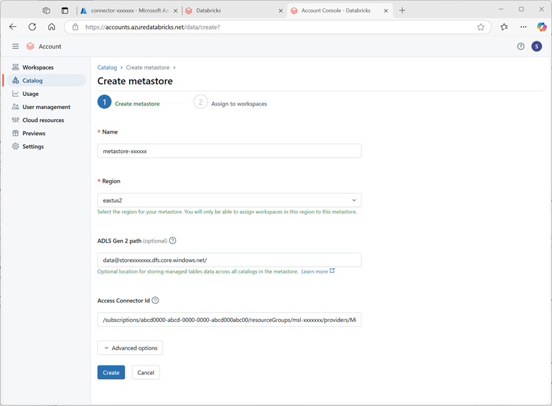
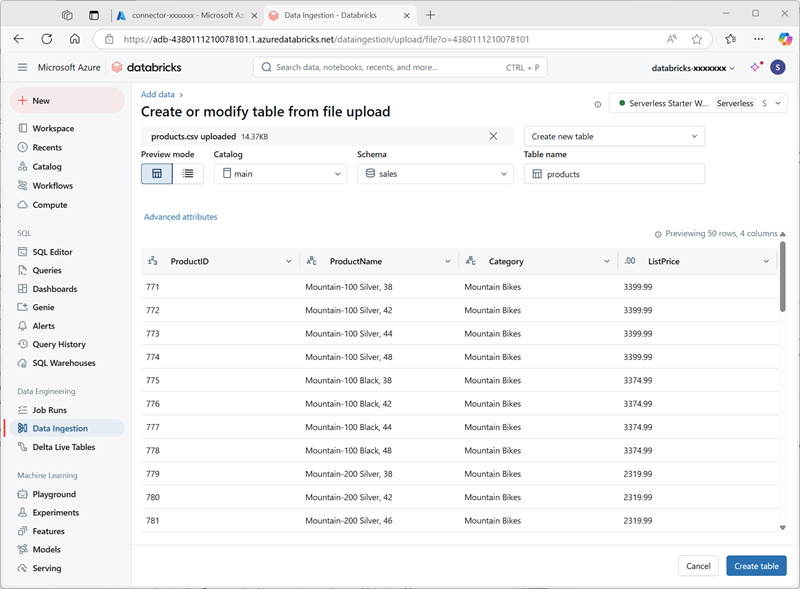

---
lab:
  title: Exploración de Unity Catalog de Azure Databricks
---

# Exploración de Unity Catalog de Azure Databricks

Unity Catalog ofrece una solución de gobernanza centralizada para datos e IA, simplificando la seguridad al proporcionar un lugar central para administrar y auditar el acceso a los datos. En este ejercicio, configurarás Unity Catalog para un área de trabajo de Azure Databricks y la usarás para administrar los datos.

> **Nota**: en algunos casos, es posible que el Unity Catalog ya esté habilitado para el área de trabajo. Todavía puedes seguir los pasos de este ejercicio para asignar una nueva cuenta de almacenamiento para el catálogo.

Este laboratorio tardará aproximadamente **45** minutos en completarse.

> **Nota**: la interfaz de usuario de Azure Databricks está sujeta a una mejora continua. Es posible que la interfaz de usuario haya cambiado desde que se escribieron las instrucciones de este ejercicio.

## Antes de comenzar

Necesitarás una [suscripción a Azure](https://azure.microsoft.com/free) en la que tengas <u>derechos de administrador global</u>.

> **IMPORTANTE**: en este ejercicio se supone que tienes derechos de *administrador global* en tu suscripción a Azure. Este nivel de acceso es necesario para administrar la cuenta de Databricks con el fin de habilitar Unity Catalog en un área de trabajo de Azure Databricks.

## Creación de un área de trabajo de Azure Databricks

> **Sugerencia**: si ya tienes un área de trabajo de Azure Databricks de nivel premium, puedes omitir este procedimiento y utilizar tu área de trabajo existente.

1. Inicie sesión en **Azure Portal** en `https://portal.azure.com`.
2. Crea un recurso de **Azure Databricks** con la siguiente configuración:
    - **Suscripción**: *Seleccione la suscripción de Azure*
    - **** Grupo de recursos: *crea un nuevo grupo de recursos denominado `msl-xxxxxxx` (donde "xxxxxxx" es un valor único)*
    - **Nombre del área de trabajo**: `databricks-xxxxxxx`*(donde "xxxxxxx" es el valor usado en el nombre del grupo de recursos)*.
    - **Región**: *selecciona cualquier región disponible*.
    - **Plan de tarifa**: *Premium* o *Prueba*
    - **Nombre del grupo de recursos administrados**: `databricks-xxxxxxx-managed`*(donde "xxxxxxx" es el valor usado en el nombre del grupo de recursos)*.

    

3. Selecciona **Revisar y crear** y espera a que se complete la implementación.

## Preparación del almacenamiento para el catálogo

Al usar Unity Catalog en Azure Databricks, los datos se guardan en un almacenamiento externo que se puede compartir entre varias áreas de trabajo. En Azure, es habitual usar una cuenta de Azure Storage con compatibilidad con un espacio de nombres jerárquico de Azure Data Lake Storage Gen2 para este fin.

1. En Azure Portal, crea un nuevo recurso **Cuenta de almacenamiento** con la siguiente configuración:
    - **Aspectos básicos**:
        - **Suscripción**: *Seleccione la suscripción de Azure*
        - **Grupo de recursos**: *selecciona el grupo de recursos **msl-xxxxxxx** existente en el que has creado el área de trabajo de Azure Databricks.*
        - **Nombre de la cuenta de almacenamiento**: `storexxxxxxx`*(donde "xxxxxxx" es el valor usado en el nombre del grupo de recursos)*
        - **Región**: *selecciona la <u>región donde has creado el área de trabajo de Azure Databricks</u>*
        - **Servicio principal**: Azure Blob Storage o Azure Data Lake Storage Gen2
        - **Rendimiento**: Estándar
        - **Redundancia**: almacenamiento con redundancia local (LRS) *(para una solución que no sea de producción como este ejercicio, esta opción tiene ventajas de menor coste y consumo de capacidad)*
    - **Avanzado**:
        - **Habilitar el espacio de nombres jerárquico**: *Seleccionado*
    
    

1. Selecciona **Revisar y crear** y espera a que se complete la implementación.
1. Cuando se haya completado la implementación, ve al recurso de la cuenta de almacenamiento *storexxxxxxx* implementada y usa su página **Explorador de almacenamiento** para agregar un nuevo contenedor de blobs denominado `data`. Aquí es donde se almacenarán los datos de tus objetos de Unity Catalog.

    

## Configuración del acceso al almacenamiento del catálogo

Para acceder al contenedor de blobs que has creado en Unity Catalog, el área de trabajo de Azure Databricks debe usar una cuenta administrada para conectarse a la cuenta de almacenamiento a través de un *conector de acceso*.

1. En Azure Portal, crea un nuevo recurso **Conector de acceso para Azure Databricks** con la siguiente configuración:
    - **Suscripción**: *Seleccione la suscripción de Azure*
    - **Grupo de recursos**: *selecciona el grupo de recursos **msl-xxxxxxx** existente en el que has creado el área de trabajo de Azure Databricks.*
    - **Nombre**: `connector-xxxxxxx`*(donde "xxxxxxx" es el valor usado en el nombre del grupo de recursos)*
    - **Región**: *selecciona la <u>región donde has creado el área de trabajo de Azure Databricks</u>*

    

1. Selecciona **Revisar y crear** y espera a que se complete la implementación. Después ve al recurso implementado y en su página **Información general**, anota el **Id. de recurso**, que debe tener el formato */subscriptions/abc-123.../resourceGroups/msl-xxxxxxx/providers/Microsoft.Databricks/accessConnectors/connector-xxxxxxx*: lo necesitarás más adelante.
1. En Azure Portal, vuelve al recurso de cuenta de almacenamiento *storexxxxxxx* y, en su página **Control de acceso (IAM)**, agrega una nueva asignación de roles.
1. En la lista **Roles de función de trabajo**, busca y selecciona el rol `Storage blob data contributor`.

    

1. Seleccione **Siguiente**. Después, en la página **Miembros**, selecciona la opción para asignar acceso a una **Identidad administrada** y después busca y selecciona el conector de acceso de Azure Databricks `connector-xxxxxxx` que has creado anteriormente (puedes ignorar cualquier otro conector de acceso que se haya creado en tu suscripción)

    

1. Revisa y asigna la pertenencia a roles para agregar la identidad administrada para tu conector de acceso *connector-xxxxxxx* para Azure Databricks al rol de colaborador de datos de blob de almacenamiento para tu cuenta de almacenamiento *storexxxxxxx*: habilitarlo te permite acceder a los datos de tu cuenta de almacenamiento.

## Configuración de Unity Catalog

Ahora que has creado un contenedor de Blob Storage para el catálogo y has proporcionado una manera de que una identidad administrada de Azure Databricks acceda a él, puedes configurar el Unity Catalog para que use un metastore basado en tu cuenta de almacenamiento.

1. En Azure Portal, consulta el grupo de recursos **msl-*xxxxxxx***, que ahora debe contener tres recursos:
    - El área de trabajo **databricks-*xxxxxxx*** de Azure Databricks
    - La cuenta de almacenamiento **store*xxxxxxx***
    - El conector de acceso **connector-*xxxxxxx*** para Azure Databricks

1. Abre el recurso de área de trabajo de Azure Databricks **databricks-xxxxxxx** que has creado anteriormente y, en su página **Información general**, usa el botón **Iniciar área de trabajo** para abrir tu área de trabajo de Azure Databricks en una nueva pestaña del explorador; inicia sesión si se te solicita.
1. En el menú **databricks-*xxxxxxx*** de la parte superior derecha, selecciona **Administrar cuenta** para abrir la consola de la cuenta de Azure Databricks en otra pestaña.

    

    > **Nota**: Si ***Administrar cuenta*** no aparece o no se abre correctamente, es posible que tengas que pedir a un administrador global que agregue tu cuenta al rol ***Administrador de cuenta*** en tu área de trabajo de Azure Databricks.
    >
    > Si estás usando una suscripción personal de Azure que has creado usando una cuenta personal de Microsoft (como una cuenta de oultook.com), es posible que se haya creado automáticamente una cuenta "externa" de Entra ID en tu directorio de Azure, y es posible que tengas que iniciar sesión usando ese nombre de cuenta.
    >
    > Consulta ***[este hilo de preguntas y respuestas](https://learn.microsoft.com/answers/questions/2133569/not-able-to-access-databricks-manage-account-conso)*** para obtener ayuda.

1. En la consola de la cuenta de Azure Databricks, en la página **Catálogo**, selecciona **Crear metastore**.
1. Cree un nuevo metastore con la siguiente configuración:
    - **Nombre**: `metastore-xxxxxxx`*(donde xxxxxxx es el valor único que has estado usando para los recursos de este ejercicio)*
    - **Región**: *selecciona la región donde has creado tus recursos de Azure*.
    - **Ruta de acceso de ADLS Gen 2**: `data@storexxxxxxx.dfs.core.windows.net/`*(donde storexxxxxx es el nombre de tu cuenta de almacenamiento)*
    - **Id. del conector de acceso**: *el Id. de recurso para tu conector de acceso (copiado de su página Información general de Azure Portal)*

    

1. Después de crear el metastore, selecciona el área de trabajo **databricks-*xxxxxxx*** y asígnale el metastore.

    

## Trabajar con datos de Unity Catalog

Ahora que has asignado un metastore eterno y habilitado Unity Catalog, puedes usarlo para trabajar con datos en Azure Databricks.

### Creación y carga de una tabla

1. Cierra la pestaña del explorador de la consola de la cuenta de Azure Databricks y vuelve a la pestaña del área de trabajo de Azure Databricks. Después <u>actualiza el explorador</u>.
1. En la página **Catálogo**, selecciona el catálogo **Principal** de tu organización y observa que los esquemas denominados **predeterminado** e **Information_schema** ya se han creado en tu catálogo.

    

1. Selecciona **Crear esquema** y crea un nuevo esquema denominado `sales` (deja la ubicación de almacenamiento sin especificar para que se use el metastore predeterminado para el catálogo).
1. En una nueva pestaña del explorador, descarga el archivo [**products.csv**](https://raw.githubusercontent.com/MicrosoftLearning/mslearn-databricks/main/data/products.csv) de `https://raw.githubusercontent.com/MicrosoftLearning/mslearn-databricks/main/data/products.csv` a tu equipo local y guárdalo como **products.csv**.
1. En el explorador Catálogo del área de trabajo de Azure Databricks, con el esquema **ventas** seleccionado, selecciona **Crear** > **Crear tabla**. Después, carga el archivo **products.csv** que has descargado para crear una nueva tabla denominada **productos** en el esquema **ventas**.

    > **Nota**: es posible que tengas que esperar unos minutos para que se inicie el proceso sin servidor.

    

1. Cree la tabla . Si se sugiere una descripción generada por IA, acéptala.

### Administración de permisos

1. Con la tabla **productos** seleccionada, en la pestaña **Permisos**, comprueba que de forma predeterminada no hay permisos asignados para la nueva tabla (puedes acceder a ella porque tienes derechos administrativos completos, pero ningún otro usuario puede consultar la tabla).
1. Selecciona **Conceder** y configura el acceso a la tabla de la manera siguiente:
    - **Entidades de seguridad**: todos los usuarios de la cuenta
    - **Privilegios**: SELECT
    - **Privilegios adicionales necesarios para el acceso**: concede también USE SCHEMA en main.sales.

    

### Seguimiento del linaje

1. En el menú **+ Nuevo**, selecciona **Consulta** y crea una nueva consulta con el siguiente código SQL:

    ```sql
    SELECT Category, COUNT(*) AS Number_of_Products
    FROM main.sales.products
    GROUP BY Category; 
    ```

1. Asegúrate de que el proceso sin servidor está conectado y ejecuta la consulta para ver los resultados.

    

1. Guarda la consulta como `Products by Category` en la carpeta del área de trabajo de tu cuenta de usuario de Azure Databricks.
1. Vuelve a la página **Catálogo**. Después, expande el catálogo **principal** y el esquema **ventas**, y selecciona la tabla **productos**.
1. En la pestaña **Linaje**, selecciona **Consultas** para comprobar Unity Catalog ha rastreado el linaje desde la consulta que has creado hasta la tabla de origen.

    

## Limpieza

En este ejercicio, has habilitado y configurado Unity Catalog para un área de trabajo de Azure Databricks y lo has usado para trabajar con datos en un metastore. Para obtener más información sobre lo que puedes hacer con Unity Catalog en Azure Databricks, consulta [Gobernanza de datos con Unity Catalog](https://learn.microsoft.com/azure/databricks/data-governance/).

Si has terminado de explorar Azure Databricks, puedes eliminar los recursos que has creado para evitar costes innecesarios de Azure y liberar capacidad en la suscripción.
